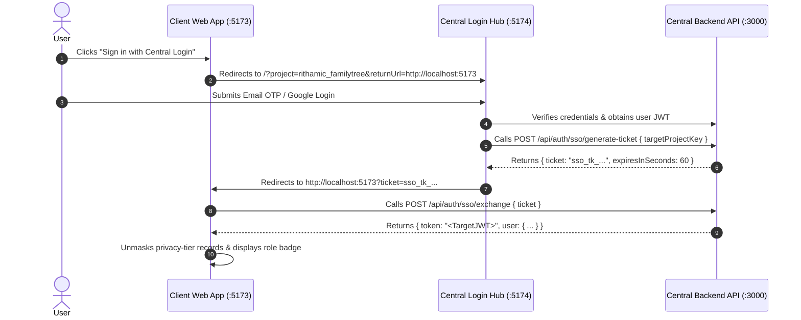

# Rithamic Login & Single Sign-On (SSO) Integration Standard

This document details how any application in the Rithamic ecosystem integrates with the centralized **`rithamic-login`** authority and backend auth endpoints.

---

## 1. Authentication Mechanisms Supported

| Flow | Protocol / Endpoint | Description |
|:---|:---|:---|
| **1. 6-Digit Email OTP** | `POST /api/auth/:projectKey/otp/request`<br>`POST /api/auth/:projectKey/otp/verify` | Numeric one-time password with rate limiting and 60s resend cooldown. |
| **2. Google OAuth 2.0** | `POST /api/auth/oauth/google` | Google ID Token verification with automated user provisioning in `app_users`. |
| **3. Magic Link** | `POST /api/auth/:projectKey/magic-link/request`<br>`POST /api/auth/:projectKey/magic-link/verify` | 15-minute cryptographically signed passwordless sign-in URL. |
| **4. Hybrid Cross-App SSO** | `POST /api/auth/sso/generate-ticket`<br>`POST /api/auth/sso/exchange` | 60-second single-use cryptographic tickets for seamless cross-domain launches. |
| **5. Session Refresh** | `POST /api/auth/refresh` | Extends active session JWTs without re-prompting credentials. |
| **6. Security Audit Trail** | Logged to `audit_logs` table | Records `LOGIN`, `LOGOUT`, `OTP_REQUEST`, `OTP_FAIL`, `SSO_GENERATE`, `SSO_EXCHANGE`. |

---

## 2. Local Development Mode (`devOtp`)

In local development (`NODE_ENV === 'development'`), developers can test authentication without active SMTP mail servers:
1. **Console Logging**: The backend prints the generated 6-digit OTP code prominently to stdout:
   ```text
   ======================================================
   🔑 DEV OTP CODE FOR [gowtham@rithamic.co.in]: 👉 849201 👈
   ======================================================
   ```
2. **API Response Payload**: The endpoint includes `devOtp: "849201"`.
3. **Frontend Helper**: Client applications (`rithamic-login`, `rithamic-familytree`) automatically display and populate the OTP on screen in development mode.

---

## 3. Client SSO Handshake Workflow



---

## 4. Privacy Tiers & Data Masking

Applications implement two tiers of data visibility:

1. **Public / Unauthenticated Mode**:
   - Confidential fields (contact numbers, home addresses, private historical notes) are masked:
     ```text
     +91 94882 •••••
     23/2, Sakthi Nagar •••••
     ```
2. **Authenticated / Protected Mode**:
   - Once validated via JWT token, full contact details, addresses, and administrative controls are unlocked.
